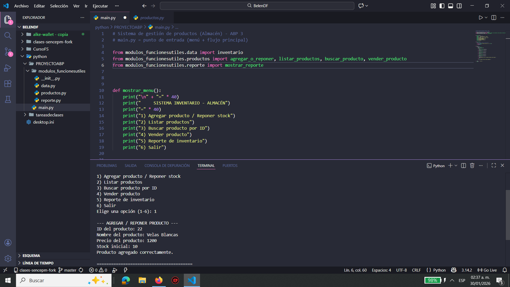
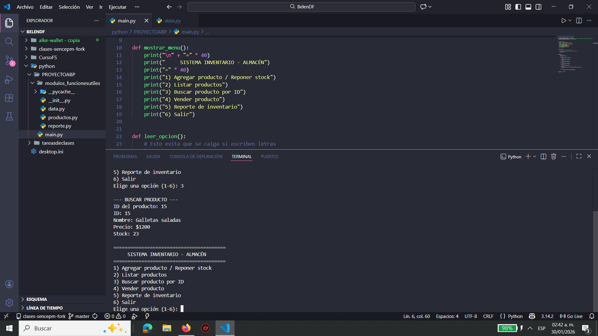

# 📦 Sistema de Inventario – Almacén (ABP 3)

Proyecto desarrollado en Python como parte del ABP 3.  
El sistema permite gestionar el inventario de un almacén mediante consola,
utilizando un enfoque modular.

---

## 🎯 Objetivo del proyecto
Desarrollar un sistema que permita:
- Agregar y reponer productos
- Listar productos disponibles
- Buscar productos por ID
- Vender productos y actualizar stock
- Visualizar un reporte del inventario

---

## 🗂️ Estructura del proyecto

El proyecto está organizado de forma modular:

- **main.py**  
  Archivo principal. Contiene el menú y controla el flujo del programa.

- **modulos_funcionesutiles/**
  - **data.py**: contiene el inventario inicial.
  - **productos.py**: funciones para agregar, listar, buscar y vender productos.
  - **reporte.py**: genera el reporte del inventario.
  - **__init__.py**: permite que la carpeta funcione como módulo.

---

## ⚙️ Descripción de módulos

- **main.py**  
  Punto de entrada del sistema. Contiene el menú y controla el flujo principal.

- **data.py**  
  Contiene el inventario inicial, almacenado en un diccionario.

- **productos.py**  
  Funciones para agregar/reponer productos, listar, buscar y vender.

- **reporte.py**  
  Genera un reporte general del inventario.

---

## 📋 Menú del sistema

1. Agregar producto / Reponer stock  
2. Listar productos  
3. Buscar producto por ID  
4. Vender producto  
5. Reporte de inventario  
6. Salir  

---

## 🖥️ Evidencia de funcionamiento

Las siguientes imágenes muestran el sistema funcionando correctamente:

### Menú principal

### Agregar producto nuevo

### Listar productos

### Buscar producto

### Reporte de inventario

